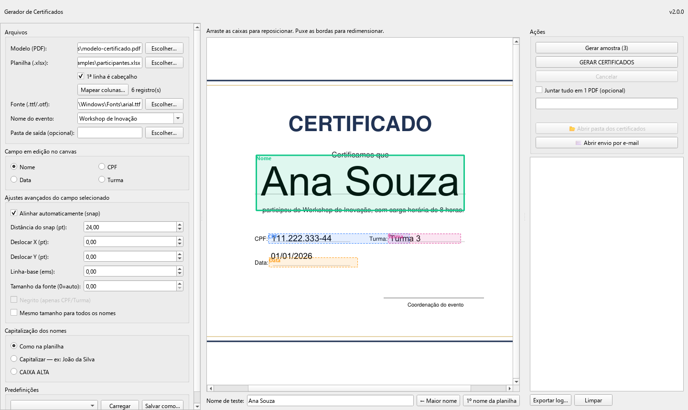
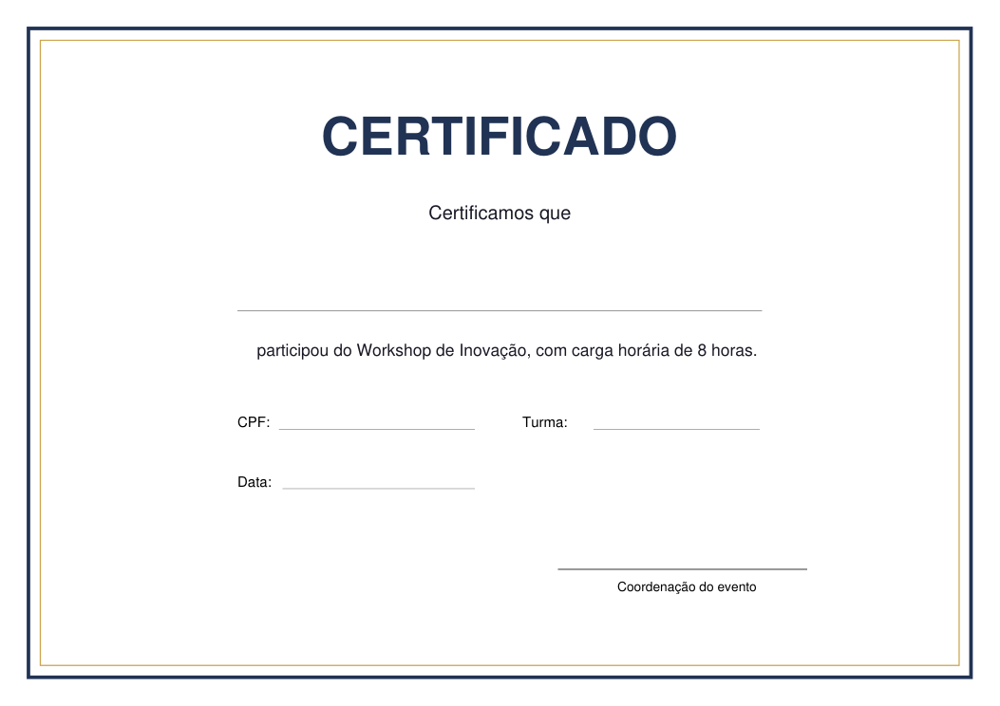
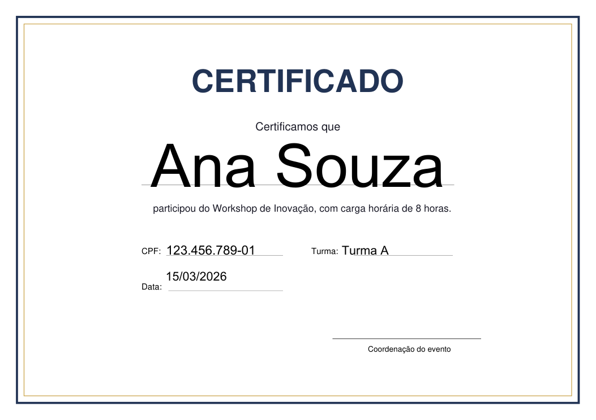

# certgen

**Batch certificate generator for Windows.** Pick a PDF template, a spreadsheet of participants and a font; certgen places each person's data on the template, generates one PDF per person and can email them out — packaged as a single `.exe` that non-technical staff run without installing anything.

> 🇧🇷 Gerador de certificados em lote: modelo em PDF + planilha (.xlsx) → um PDF por participante, com envio opcional por e-mail. Interface em português.

| | |
|---|---|
| **Status** | In use (~3 events a year) |
| **Impact** | Hundreds to thousands of certificates per event, generated and e-mailed in minutes. Before, it took days of editing names into a Word template and sending them one by one |
| **Build time** | v1 in a day; this rewrite in a day, with 185 tests (traditional estimates: 1–2 and 4–6 weeks) |



| Template (input) | Generated certificate (output) |
|---|---|
|  |  |

## Features

- **Automatic field detection** — finds where the name, CPF, class and date go by locating placeholder text and line guides on the template.
- **Visual calibration** — drag and resize each field box over a live preview of the PDF; boxes snap to lines and text.
- **Text that fits** — font size is auto-fitted per field (binary search on real font metrics), with optional "same size for every name".
- **Colour-aware** — text colour is picked per field by sampling the template's background luminance.
- **Batch generation in the background** — progress, cancel, a control CSV of everything generated, optional single merged PDF, certificate IDs and QR codes, locked PDFs.
- **Email delivery** — SMTP presets (Gmail, Outlook, Zoho, Hostinger…), live per-recipient status, retry with reconnect.
- **Presets** — save and reload an event's setup; passwords are only stored if you ask.
- **Single executable** — PyInstaller onefile build with a native splash screen and a single-instance guard (double-clicking twice focuses the open window).

## Architecture

```
certgen/   headless core: detection, rendering, generation, mailer, presets (no UI imports)
ui/        PySide6 (Qt) interface: main window, canvas editor, email window, workers
tests/     185 pytest tests covering the core and key UI behaviour
```

The core is UI-independent, so everything that decides *where* and *how* text is drawn is unit-tested without a window. The UI talks to long-running work through Qt signals, so generation and email never block the interface.

This version is a ground-up rewrite of an older single-file Tkinter tool. [`PLAN.md`](PLAN.md) documents the decisions (why Qt, why PyMuPDF stayed) and [`PARITY.md`](PARITY.md) is the behaviour inventory used as the acceptance checklist, so nothing the old app did was lost. *(The legacy code itself is not included in this repository.)*

## Try it

```bash
python -m venv .venv
.venv\Scripts\activate
pip install -r requirements.txt
python main.py
```

Then load `examples/modelo-certificado.pdf`, `examples/participantes.xlsx` (tick *1ª linha é cabeçalho*) and any `.ttf` font, e.g. `C:\Windows\Fonts\arial.ttf`. All example data is fictional.

### Tests

```bash
pip install -r requirements-dev.txt
pytest
```

### Build the .exe

```powershell
.\build.ps1
```

## Stack

Python · PySide6 (Qt) · PyMuPDF · openpyxl · qrcode · PyInstaller · pytest

## How it was built

Built with AI coding agents (Claude Code and OpenAI Codex) writing the code. My part was specifying the behaviour (see `PLAN.md` and `PARITY.md`), reviewing the generated code, testing with real templates and spreadsheets, and packaging it for the team. Traditional estimates are my own ballpark for one developer writing it by hand.

---

Built by [João Barbosa](https://joaobarbosa.pages.dev) as an internal tool at his employer, and published here **with the employer's permission**. Company data, branding and the original templates have been removed; the examples are fictional.

**© João Barbosa. All rights reserved.** No open-source license is granted — you're welcome to read the code, but please don't reuse it without permission.
